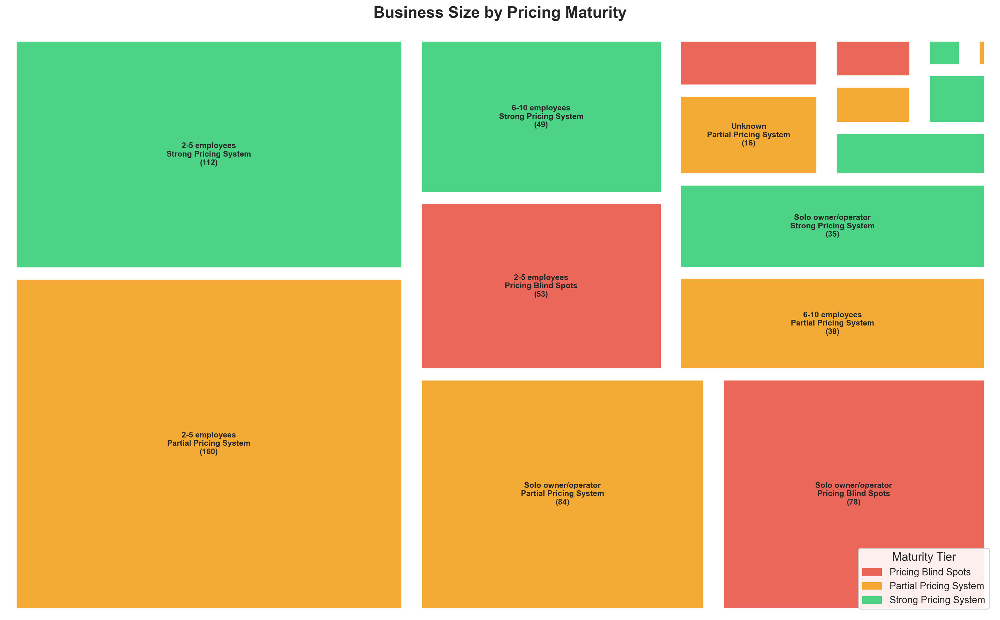
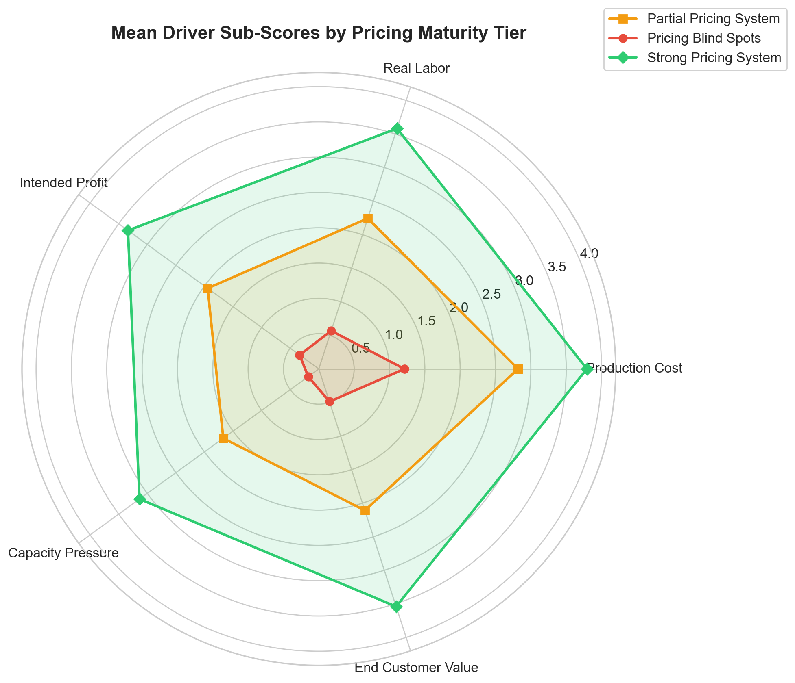
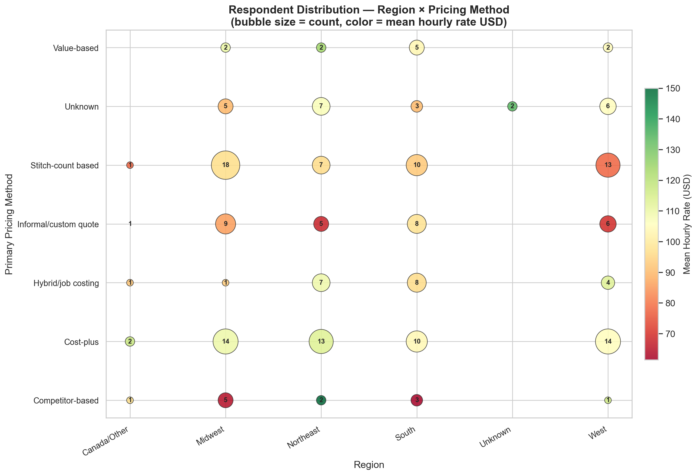
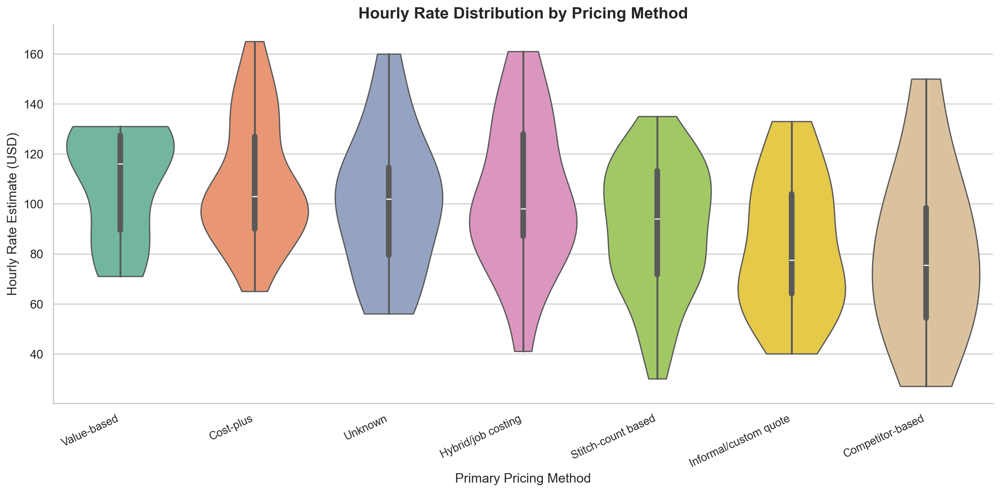
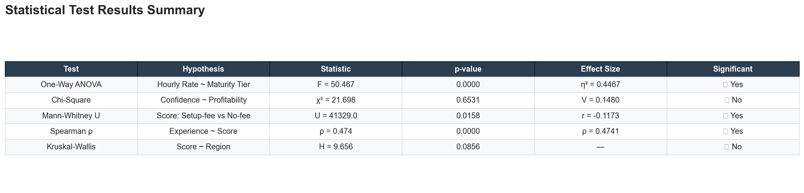
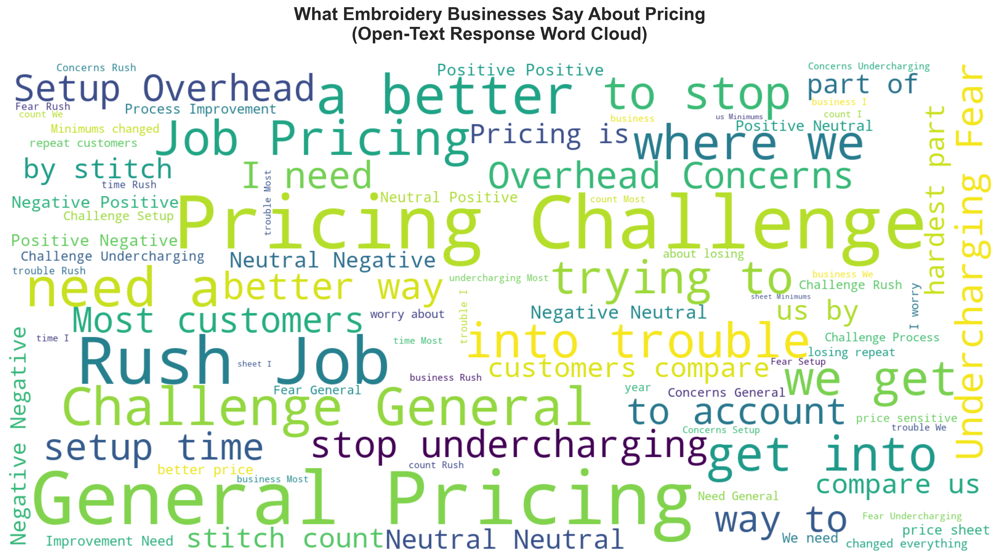

# 🧵 State of the Embroidery Industry: Pricing Diagnostics & Insights

---

## 1. Executive Summary

The embroidery and apparel decoration industry suffers from a systemic underpricing crisis, driven heavily by psychological barriers rather than mathematical ignorance. This report analyzes the pricing behaviors, financial outcomes, and confidence metrics of hundreds of shops to identify the core drivers of profitability.

**Key Takeaways:**
1. **Formalized Systems Yield Higher Revenue:** Businesses operating with a formalized "Strong Pricing System" charge approximately **$67/hour more** than those relying on gut-feeling or competitor-matching.
2. **Confidence is the Primary Bottleneck:** Qualitative NLP analysis of over 600 open-text responses reveals "undercharging anxiety" as a primary barrier to growth.
3. **The "Squeezed Middle" Suffers Most:** Businesses that know enough to track their overhead—but lack the systems to enforce proper pricing—experience the highest levels of psychological friction.
4. **Experience Does Not Guarantee Competence:** There is only a moderate correlation (ρ=0.474) between years in business and pricing maturity. Veteran shops frequently rely on outdated, unprofitable pricing models.

---

## 📊 Visual Gallery

<table>
<tr>
<td> Business Landscape Treemap</td>
<td> Radar: Driver Sub-Scores by Tier</td>
<td> Region × Pricing Method Bubble</td>
</tr>
<tr>
<td> Hourly Rate Distribution</td>
<td> Statistical Test Summary</td>
<td> Open-Text Response Word Cloud</td>
</tr>
</table>

---

## 2. Methodology

This analysis bridges behavioral pricing habits with actual financial outcomes by merging two primary datasets through a rigorous 8-phase data science pipeline:
- **Pricing Diagnostic (680 clean rows):** Behavioral data scoring shops on 5 core drivers: Production Costing, Labor Tracking, Profit Targets, Capacity Utilization, and Value-Based Pricing.
- **Financial Benchmark (200 clean rows):** Hard financial data regarding exact pricing models and calculated hourly rates.
- **Combined Cohort (142 rows):** The intersection of respondents providing both behavioral diagnostics and financial realities.

**Analytical Pipeline & Techniques:**
- **Maturity Scoring & Segmentation:** Respondents were scored out of 20 and bucketed into three tiers: *Pricing Blind Spots* (score < 7), *Partial Pricing System* (7-14), and *Strong Pricing System* (15+).
- **Outlier Handling (Winsorization):** To preserve sample size while dampening the effect of extreme tail values, a 1.5× IQR (Interquartile Range) Winsorization was applied to all continuous target variables (e.g., `hourly_rate_estimate_usd`).
- **Normality Validation:** Parametric assumptions were validated per-group using the Shapiro-Wilk test. Where normality assumptions were violated, Kruskal-Wallis non-parametric fallbacks were employed.
- **Semantic Analysis (NLP):** Utilized Azure OpenAI Large Language Models to conduct thematic clustering and sentiment analysis on over 600 free-text "pricing struggle" comments.

---

## 3. Results (Exploratory Analysis & Testing)

### 3.1 Exploratory Demographic Analysis
- **Business Size:** The market is dominated by micro-businesses; "2-5 employees" constitutes 49.0% of the sample, followed by "Solo owner/operators" (29.7%).
- **Pricing Maturity Breakdown:** The industry skews heavily toward the middle. 22.0% of shops operate entirely with "Pricing Blind Spots," 45.9% run "Partial Systems," and only 32.1% utilize "Strong Systems."

### 3.2 Statistical Testing Results
Rigorous hypothesis testing confirms the following market dynamics:

- **Test 1 — One-Way ANOVA (Hourly Rate by Maturity Tier):** 
  *Significant (F=50.47, p=4.88e-17, η²=0.447)*. Having a formalized pricing system definitively predicts higher hourly rates. The large effect size (η² = 0.447) indicates maturity tier accounts for nearly 45% of the variance in a shop's hourly rate.
- **Test 2 — Chi-Square (Confidence by Profitability):** 
  *Not Statistically Significant at α=0.05 (χ²=21.70, p=0.153, Cramér's V=0.148)*. While a visual trend exists, "confidence" alone does not reliably guarantee higher profitability margins without underlying system improvements.
- **Test 3 — Mann-Whitney U (Self-Selection Bias):** 
  *Significant (U=41329, p=0.003, rank-biserial r=-0.117)*. Shops that completed both surveys scored significantly higher on the diagnostic, indicating a self-selection effect where more engaged, pricing-aware businesses are more likely to participate in financial benchmarking.
- **Test 4 — Spearman Rank Correlation (Experience vs. Diagnostic Score):** 
  *Significant (ρ=0.474, p=2.15e-38)*. There is a moderate positive correlation. Experience helps, but does not strictly dictate pricing competence.
- **Test 5 — Ordinal Logistic Regression (Predicting Maturity):** 
  A multi-factor model identified 5 significant predictive drivers separating the top-tier shops from the bottom-tier.

---

## 4. Discussion

The data reveals that the apparel decoration industry's struggle with profitability is heavily psychological, even when accounting for statistical variance in shop size and experience. 

Semantic clustering of free-text responses highlighted **Rush Job Pricing** (106 mentions), **Undercharging Fear / Imposter Syndrome** (96 mentions), and **Setup/Overhead Concerns** (93 mentions) as the dominant industry anxieties. 

Interestingly, sentiment distribution mapping revealed that the *Partial Pricing System* tier exhibited the highest volume of negative and anxious sentiment (representing 54% of all negative comments). This indicates that shop owners who know enough to track their costs—but lack the confidence or mathematical software to enforce proper pricing—experience the highest psychological toll. The data strongly suggests that the industry's "Squeezed Middle" is hyper-aware of their shrinking margins but paralyzed on execution.

Furthermore, geographic disparities (Kruskal-Wallis: H=9.66) indicate that pricing caps and competitive pressures vary by region, necessitating localized benchmarks rather than a reliance on national averages.

---

## 5. Conclusion

To survive and thrive, embroidery businesses must transition from flat "stitch-count" algorithms into robust, value-based job-costing models. However, providing shop owners with mathematical calculators is not enough. The industry requires psychological tooling—such as confidence workshops, minimum-charge templates, and regional baselines—to break the cycle of undercharging. Data confirms that intervening at the "Squeezed Middle" will yield the highest return on investment for industry health, as moving a shop from "Pricing Blind Spots" to a "Strong System" unlocks up to $67/hour in previously unrealized revenue.
